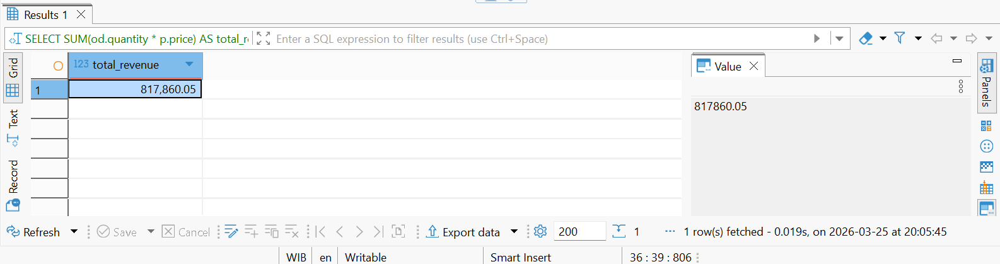
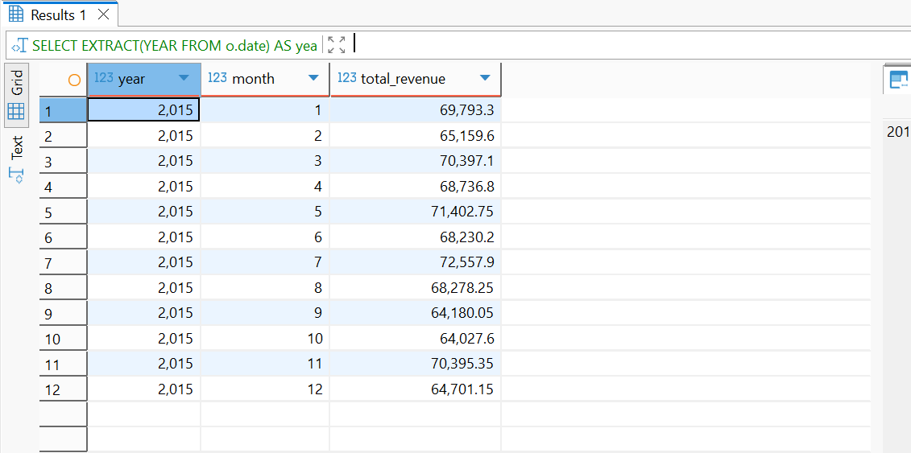
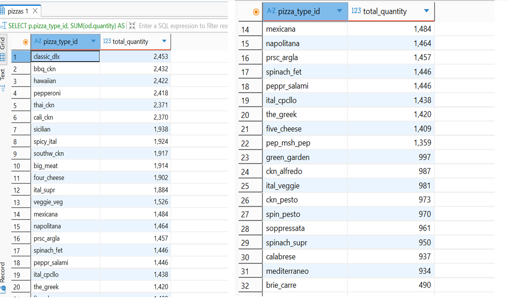
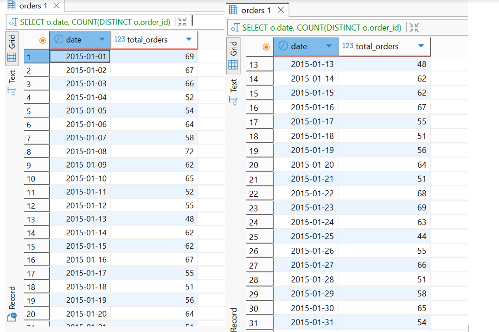
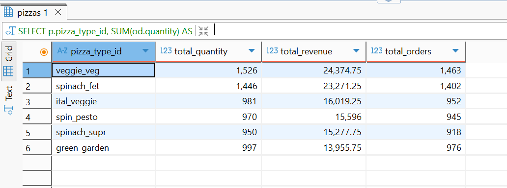

# 🍕 Pizza Sales Analysis (SQL Project)

This project analyzes pizza sales data using SQL (PostgreSQL) to uncover insights on revenue trends, product performance, and customer behavior.

## 📌 Project Overview

This project explores transactional pizza sales data to identify key business insights. The analysis focuses on revenue performance, customer ordering patterns, and product-level performance.

Using SQL, the project answers business-driven questions such as total revenue, monthly trends, best-selling products, and category performance (e.g., vegetarian pizzas). The results are presented through structured queries and visual summaries to support data-driven decision making.

---

## 🛠 Tools Used

* SQL (PostgreSQL)
* DBeaver

---

## 📊 Dataset

The dataset contains transactional data from a pizza store, including:

* Orders (date & time)
* Order details (quantity)
* Pizza information (type, size, price)

---

## 🔍 Business Questions

This analysis answers the following key questions:

1. What is the total revenue of the pizza business?
2. How does revenue perform over time (monthly)?
3. Which pizza types are the best-selling?
4. How many orders are placed per day (January analysis)?
5. How do vegetarian pizzas perform in terms of sales and orders?

---

## 📈 Key Insights

### 💰 Total Revenue

Total revenue generated:

**$817,860**



The business generates strong revenue, indicating consistent customer demand throughout the year.

---

### 📅 Monthly Revenue



Revenue appears relatively stable across months, with slight fluctuations. The highest revenue occurs in July (around $72K), while the lowest is around September–October (around $64K). This indicates a consistent demand pattern with a potential mid-year peak period.

---

### 🍕 Best-Selling Pizza

The following chart shows the total quantity sold for each pizza type:



The top-performing pizzas are **classic_dlx, bbq_ckn, and hawaiian**, each selling over 2,400 units.

In contrast, some pizza types such as **brie_carre** have significantly lower sales, indicating lower customer preference.
This suggests that a small number of menu items contribute to a large portion of total sales

---

### 📆 Daily Orders (January)



Daily orders fluctuate between **44 and 72 orders per day**, indicating variability in daily customer demand.

The highest demand occurs on **January 8 (72 orders)**, while the lowest is on **January 25 (44 orders)**. This variation suggests changing daily customer demand, which can be useful for staffing and operational planning. This pattern indicates potential peak and low-demand days that can be leveraged for operational planning.

---

### 🥦 Vegetarian Pizza Performance



Vegetarian pizzas show varied performance across menu items.

**veggie_veg** is the top-performing vegetarian pizza, generating the highest total revenue (~$24K) and the highest number of orders (1,463).  
In contrast, **green_garden** generates the lowest revenue among the vegetarian options.

Overall, the performance gap suggests that customer preferences differ significantly within the vegetarian category. This highlights opportunities for menu optimization, product improvement, and targeted promotions for lower-performing items.

---

## 🚀 How to Run

1. Import the dataset into PostgreSQL
2. Create schema and tables
3. Run SQL queries in `/sql/analysis.sql`

---

## 📁 Project Structure

```
pizza-sales-analysis/
│
├── pizza_dataset.xlsx
├── sql/
│   └── analysis.sql
├── images/
│   ├── total_revenue.png
│   ├── revenue_per_month.png
│   ├── best_selling_pizza.png
│   ├── daily_orders_january.png
│   └── vegetarian_performance.png
└── README.md
```

---

## ✨ Author

Siti Irma — Aspiring Data Analyst  
📍 Indonesia  
